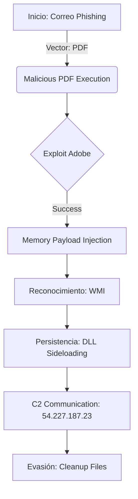
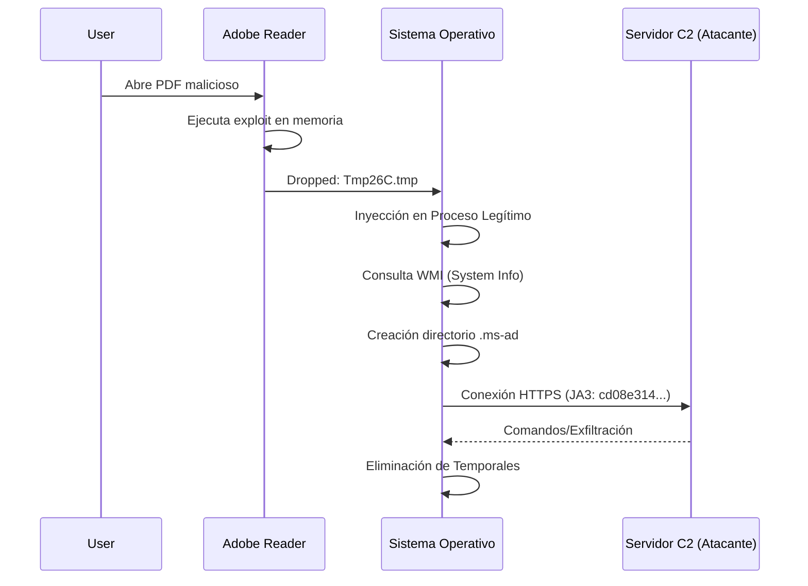

# Orquestación del Ataque PDF (Visualización)

## 1. Cadena de Matanza (Cyber Kill Chain)

## 2. Flujo Lógico de Ejecución de Malware

## 3. Matriz de Orquestación

| Etapa | Artefacto de Orquestación | Acción Técnica |
| :--- | :--- | :--- |
| **Entrada** | Malicious PDF | Desbordamiento de búfer / Scripting |
| **Profilado** | WMI Scripts | `Get-WmiObject -Class Win32_Process` |
| **Persistencia** | DLL Wrapper | Sideloading via `SOPHIA.json` |
| **Evasión** | Purge Action | `del Tmp*.tmp` |
